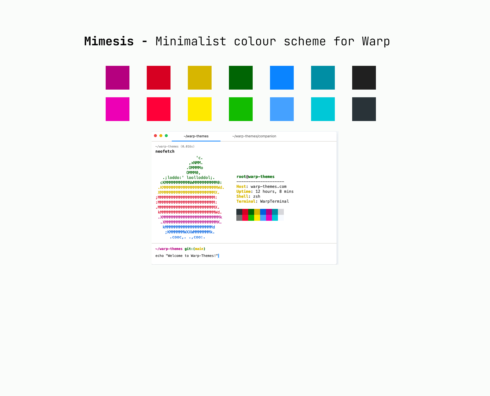

# Mimesis 
Light theme that offers a clean and elegant look for [warp](https://www.warp.dev/).

It features a combination of minimal and vibrant colors, including shades of blue, magenta, green, and gray. 

The theme provides good contrast between the background and text, making it easy to read and navigate through code. 

Well-suited for those who prefer a light and minimalist design for their coding environment.



### Installation
Download `mimesis.yaml` from the latest tag
In your terminal: 
``` sh 
mkdir -p /Users/$USER/.warp/themes/ && cp -r mimesis.yaml /Users/$USER/.warp/themes/
```
**Enjoy!**

